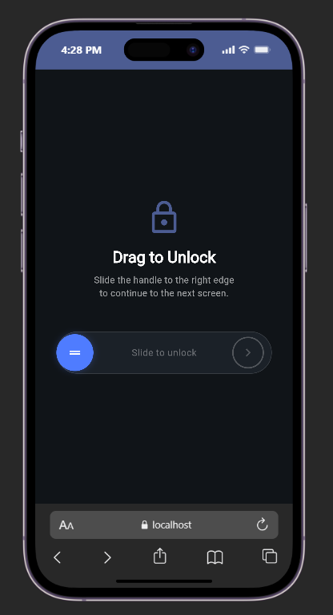
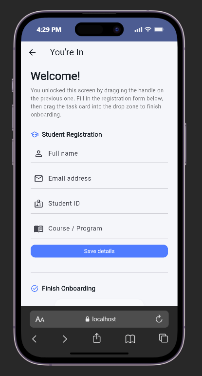
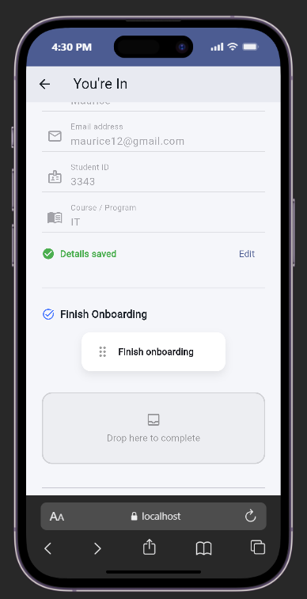
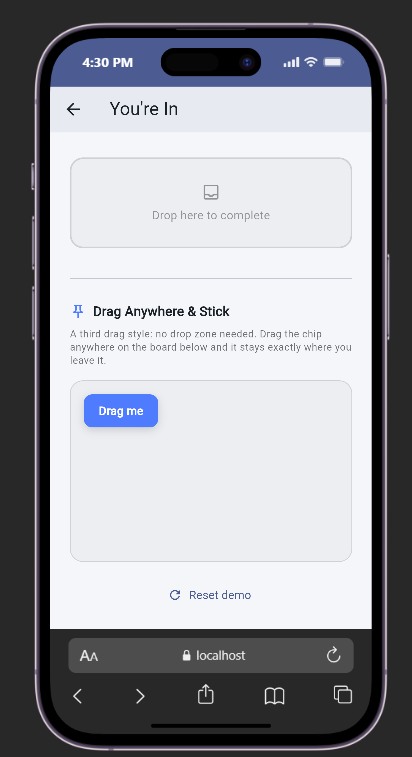

# Draggable Widget Demo — Flutter

A Flutter application that demonstrates real-world drag-and-drop interactions using the `Draggable` widget, including slide-to-unlock, task completion through drag-and-drop, and free-position dragging.

## What the demo covers:

1. **Slide to Unlock** (horizontal drag with `axis`)
2. **Drag Task Card to Complete Onboarding** (drag-and-drop using `DragTarget`)
3. **Drag Anywhere and Stick** (free dragging with `onDragEnd`)


## Table of Contents

* [Overview](#overview)
* [Demo Preview](#demo-preview)
* [Getting Started](#getting-started)
* [Project Structure](#project-structure)
* [Key Widget: Draggable](#key-widget-draggable)
* [Three Attributes Demonstrated](#three-attributes-demonstrated)
* [Credits & References](#credits--references)
* [Presentation Info](#presentation-info)

---

## Overview

The Flutter `Draggable` widget allows users to pick up a widget and move it around the screen using touch or mouse input.

This demo simulates several real-world interactions. First, the user performs a "slide to unlock" action similar to what is commonly seen on mobile devices. After unlocking, the user completes a registration process and drags a task card into a drop zone to finish onboarding. Finally, the app demonstrates free dragging where an item can be moved and left anywhere on a board.

`Draggable` is a better choice than a normal button because it creates a more interactive and intuitive experience that mimics physical movement and direct manipulation.

---

## Demo Screenshots


```markdown




```

---

## Getting Started

### Prerequisites

* Flutter SDK installed
* Android Studio, VS Code, or another Flutter-compatible IDE
* A connected device, emulator, or simulator

### Installation & Run

```bash
git clone <your-repo-url>
cd <your-repo-folder>
flutter pub get
flutter run
```

---

## Project Structure

```text
lib/
├── main.dart              # Application entry point
├── unlock_screen.dart     # Slide-to-unlock draggable demo
└── second_screen.dart     # Registration form and drag-drop examples
```

---

## Key Widget: Draggable

The `Draggable` widget allows a user to grab a widget and drag it across the screen while optionally displaying a different widget as visual feedback.

In this project, `Draggable` is used to create a slide-to-unlock mechanism, drag a task card into a completion area, and move a sticky note freely around a board.

### Example

```dart
Draggable<String>(
  data: 'unlock_handle',
  axis: Axis.horizontal,
  feedback: _Handle(dragging: true),
  childWhenDragging: const SizedBox(
    width: handleSize,
    height: handleSize,
  ),
  child: const _Handle(dragging: false),
)
```

---

## Three Attributes Demonstrated

### 1. `axis`

* **What it controls:** Restricts dragging to a specific direction.
* **What changes on screen when set:** In the Slide-to-Unlock demo, the handle can only move horizontally along the track, preventing accidental vertical movement.

### 2. `feedback`

* **What it controls:** Defines the widget shown under the user's finger or cursor while dragging.
* **What changes on screen when set:** While dragging the unlock handle or task card, a highlighted version of the widget follows the user's movement, making the interaction feel more responsive.

### 3. `childWhenDragging`

* **What it controls:** Determines what appears in place of the original widget while it is being dragged.
* **What changes on screen when set:** The original widget becomes faded or disappears while dragging, clearly showing that the item is currently in motion.

---

## Additional Features

### DragTarget Integration

The onboarding task card can be dragged into a `DragTarget`. Once dropped successfully, the onboarding process is marked as complete and the user receives visual confirmation.

### Free Position Dragging

The "Drag Anywhere & Stick" section demonstrates how `onDragEnd` can be used to calculate a final position and leave a draggable widget exactly where the user drops it.

---

## Credits & References

* Flutter Official Documentation:
  [https://docs.flutter.dev](https://docs.flutter.dev)

* Draggable Widget Documentation:
  [https://api.flutter.dev/flutter/widgets/Draggable-class.html](https://api.flutter.dev/flutter/widgets/Draggable-class.html)

* DragTarget Widget Documentation:
  [https://api.flutter.dev/flutter/widgets/DragTarget-class.html](https://api.flutter.dev/flutter/widgets/DragTarget-class.html)

* All application code and UI implementation were developed specifically for this project.

---

## Presentation Info

* **Presenter:** Maurice NSHIMYUMUKIZA
* **Widget Assigned:** Draggable
* **Presentation Date:** 06/24/2026

---

### Demonstration Flow

1. Launch the application.
2. Drag the handle to the right to unlock the next screen.
3. Complete the student registration form.
4. Save the form details.
5. Drag the onboarding task card into the drop zone.
6. Observe the completion confirmation.
7. Experiment with dragging the sticky chip anywhere on the board.

This flow demonstrates multiple practical uses of Flutter's `Draggable` widget within a single application.
